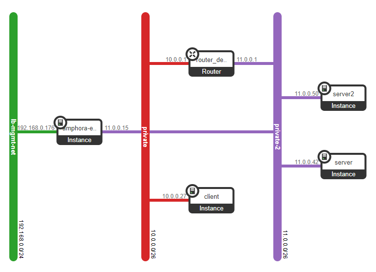

# L2DSR Guide (vThunder)

## Transparent Mode DSR Deployment
For L2DSR, the vThunder is attached to the same network as the real servers using a singular ethernet connection. This is known as "one-arm" configuration. The A10 Octavia service will handle the deployment and configuration of the vThunder device; however, it is up to the operator to configure the real servers. Though the following example deployment uses a vThunder deployed with Single topology, Active-Standby deployments are supported.

#### Limitations
- The vThunder, loadbalancer, and the real servers all must be in the same subnet.
- The Openstack port used to connect the vThunder to the network will have 0.0.0.0/0 as an allowed address pair allowing traffic from all IPs to flow from the port. However, this traffic must come from the MAC of the vThunder's NIC.
- IPv4 is supported on listener types TCP and UDP
- IPv6 is not supported

### Example Network



- 1 Neutron Router deployed **without** SNAT
- 1 client created on the private network
- 2 real servers created on the private-2 network

The vThunder (amphora) is deployed on the private-2 network by A10 Octavia during the loadbalancer creation step.


### 1. Update the A10 Octavia config

Add the following to the /etc/a10/a10-octavia.conf file created in the Install A10 Networks Octavia section

```
[listener]
no_dest_nat=True
autosnat=False
use_rsv_hop_for_resp=False
```

*Note: These listener settings are applied globally to all listeners created after service restart*

### 2. Create the Openstack objects

#### 2a. Create the loadbalancer flavor with dsr_type set
```
openstack loadbalancer flavorprofile create --name fp_l2dsr --provider a10 --flavor-data '{"deployment": {"dsr_type":"l2dsr_transparent"}}'
```

```
+---------------+--------------------------------------------------+
| Field         | Value                                            |
+---------------+--------------------------------------------------+
| id            | 25d33bf0-9f14-4928-b4a4-ffb482b17a9b             |
| name          | fp_l2dsr                                         |
| provider_name | a10                                              |
| flavor_data   | {"deployment": {"dsr_type":"l2dsr_transparent"}} |
+---------------+--------------------------------------------------+
```

```
openstack loadbalancer flavor create --name f_l2dsr --flavorprofile fp_l2dsr --enable
```

```
+-------------------+--------------------------------------+
| Field             | Value                                |
+-------------------+--------------------------------------+
| id                | fa0086a7-a653-49a4-ac53-bf8665d9a1ae |
| name              | f_l2dsr                              |
| flavor_profile_id | 25d33bf0-9f14-4928-b4a4-ffb482b17a9b |
| enabled           | True                                 |
| description       |                                      |
+-------------------+--------------------------------------+
```

#### 2b. Deploy a loadbalancer with the flavor
```
openstack loadbalancer create --name vs1 --vip-subnet-id private-2-subnet --vip-address 11.0.0.22 --flavor f_l2dsr
```

```
+---------------------+--------------------------------------+
| Field               | Value                                |
+---------------------+--------------------------------------+
| admin_state_up      | True                                 |
| created_at          | 2021-06-22T20:56:27                  |
| description         |                                      |
| flavor_id           | fa0086a7-a653-49a4-ac53-bf8665d9a1ae |
| id                  | 0110dba3-fac7-4e47-af3d-d1a82cc4eaab |
| listeners           |                                      |
| name                | vs1                                  |
| operating_status    | OFFLINE                              |
| pools               |                                      |
| project_id          | b27c7299750e48ed9a49fe5f41fb7cff     |
| provider            | a10                                  |
| provisioning_status | PENDING_CREATE                       |
| updated_at          | None                                 |
| vip_address         | 11.0.0.22                            |
| vip_network_id      | c1dcc96b-9c45-4d65-bf8a-041784b83c86 |
| vip_port_id         | bd816d34-48da-4175-9ebb-b7abf0350a1d |
| vip_qos_policy_id   | None                                 |
| vip_subnet_id       | 70541ee8-1bc1-45a8-bb44-361576cf10fb |
+---------------------+--------------------------------------+
```

Be sure to confirm that the flavor_id matches the previously created l2dsr flavor

#### 2c. Create the listener
```
openstack loadbalancer listener create --name l1 vs1 --protocol tcp --protocol-port 80
```

Confirm that `no_dest_nat` was configured on the virtual port. The `use_rsv_hop_for_resp` and `autosnat` will not be shown on the device as
they were set to False.

```
slb virtual-server 0110dba3-fac7-4e47-af3d-d1a82cc4eaab 11.0.0.22
  port 80 tcp
    name 75254d0b-6345-4615-9daf-1d3e819138d4
    extended-stats
    no-dest-nat
!
```

#### 2d. Create the pool and members
```
openstack loadbalancer pool create --protocol TCP --lb-algorithm ROUND_ROBIN --listener l1 --name p1
openstack loadbalancer member create --address 11.0.0.42 --subnet-id private-2-subnet --protocol-port 80 --name mem1 p1
openstack loadbalancer member create --address 11.0.0.50 --subnet-id private-2-subnet --protocol-port 80 --name mem2 p1
```

Confirm that the SLB objects are present on the vThunder

```
!
slb server b27c7_11_0_0_42 11.0.0.42
  port 80 tcp
!
slb server b27c7_11_0_0_50 11.0.0.50
  port 80 tcp
!
slb service-group c8e1f29e-bbed-477e-a58b-5890fecfcc81 tcp
  member b27c7_11_0_0_42 80
  member b27c7_11_0_0_50 80
!
slb virtual-server 0110dba3-fac7-4e47-af3d-d1a82cc4eaab 11.0.0.22
  port 80 tcp
    name 75254d0b-6345-4615-9daf-1d3e819138d4
    extended-stats
    service-group c8e1f29e-bbed-477e-a58b-5890fecfcc81
    no-dest-nat
!
```


### 3. Configure the real servers

#### 3a. Locate the real server interface ports

```
openstack port list
```

```
+--------------------------------------+------+-------------------+------------------------------------------------------------------------------+--------+
| ID                                   | Name | MAC Address       | Fixed IP Addresses                                                           | Status |
+--------------------------------------+------+-------------------+------------------------------------------------------------------------------+--------+
|                 ...                  | ...  |         ...       |                                  ...                                         |   ...  |
| 39a3c109-15d3-49a8-9c79-687d4bfa0309 |      | fa:16:3e:bc:69:b0 | ip_address='11.0.0.50', subnet_id='70541ee8-1bc1-45a8-bb44-361576cf10fb'     | ACTIVE |
| cefb35b6-d2e7-45c7-9622-a1b5ea0fc3c1 |      | fa:16:3e:96:15:d9 | ip_address='11.0.0.42', subnet_id='70541ee8-1bc1-45a8-bb44-361576cf10fb'     | ACTIVE |
+--------------------------------------+------+-------------------+------------------------------------------------------------------------------+--------+
```

#### 3b. Add the VIP address as an allowed address pair

```
openstack port set 39a3c109-15d3-49a8-9c79-687d4bfa0309 --allowed-address ip-address=11.0.0.22
openstack port set cefb35b6-d2e7-45c7-9622-a1b5ea0fc3c1 --allowed-address ip-address=11.0.0.22
```

Confirm that the AAPs were added
```
$ openstack port show 39a3c109-15d3-49a8-9c79-687d4bfa0309 | grep "allowed_address_pairs"
| allowed_address_pairs   | ip_address='11.0.0.22', mac_address='fa:16:3e:bc:69:b0'
```

```
$ openstack port show 39a3c109-15d3-49a8-9c79-687d4bfa0309 | grep "allowed_address_pairs"
| allowed_address_pairs   | ip_address='11.0.0.22', mac_address='fa:16:3e:96:15:d9'
```

#### 3c. Add the VIP address to the loopbacks

**Server 1**
```
ip addr add 11.0.0.22/32 dev lo
```

```
root@server:~# ip a
1: lo: <LOOPBACK,UP,LOWER_UP> mtu 65536 qdisc noqueue state UNKNOWN group default qlen 1
    link/loopback 00:00:00:00:00:00 brd 00:00:00:00:00:00
    inet 127.0.0.1/8 scope host lo
       valid_lft forever preferred_lft forever
    inet 11.0.0.22/32 scope global lo
       valid_lft forever preferred_lft forever
    inet6 ::1/128 scope host
       valid_lft forever preferred_lft forever
2: ens2: <BROADCAST,MULTICAST,UP,LOWER_UP> mtu 1450 qdisc pfifo_fast state UP group default qlen 1000
    link/ether fa:16:3e:96:15:d9 brd ff:ff:ff:ff:ff:ff
    inet 11.0.0.42/26 brd 11.0.0.63 scope global ens2
       valid_lft forever preferred_lft forever
    inet6 fe80::f816:3eff:fe96:15d9/64 scope link
       valid_lft forever preferred_lft forever
```

**Server 2**
```
ip addr add 11.0.0.22/32 dev lo
```

```
root@server2:~# ip a
1: lo: <LOOPBACK,UP,LOWER_UP> mtu 65536 qdisc noqueue state UNKNOWN group default qlen 1
    link/loopback 00:00:00:00:00:00 brd 00:00:00:00:00:00
    inet 127.0.0.1/8 scope host lo
       valid_lft forever preferred_lft forever
    inet 11.0.0.22/32 scope global lo
       valid_lft forever preferred_lft forever
    inet6 ::1/128 scope host
       valid_lft forever preferred_lft forever
2: ens2: <BROADCAST,MULTICAST,UP,LOWER_UP> mtu 1450 qdisc pfifo_fast state UP group default qlen 1000
    link/ether fa:16:3e:bc:69:b0 brd ff:ff:ff:ff:ff:ff
    inet 11.0.0.50/26 brd 11.0.0.63 scope global ens2
       valid_lft forever preferred_lft forever
    inet6 fe80::f816:3eff:febc:69b0/64 scope link
       valid_lft forever preferred_lft forever
```

*Note: ARP replies from the loopback interface housing the VIP address must be disabled. This is the default behavior of lo interfaces.*

### 4. Confirm that traffic is being balanced

```
root@client:~# curl 11.0.0.22
----------------------
Page from server1

----------------------

root@client:~# curl 11.0.0.22
----------------------
Page from server2

----------------------
```
